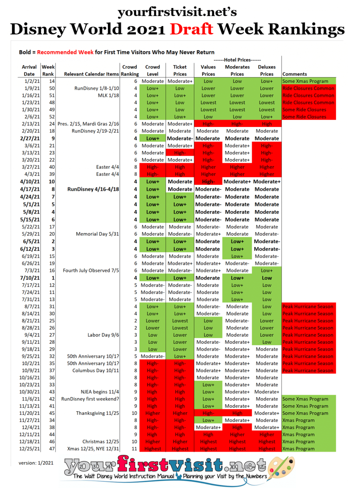

```{r setup, include=FALSE}
knitr::opts_chunk$set(echo = FALSE, message = FALSE)
```

```{r packages}
library(tidyverse)
#library(here)
library(janitor)
```


```{r load-data}
pirates_waits <- read_csv("data/pirates_of_caribbean.csv") %>% clean_names()
mine_train_waits <- read_csv("data/7_dwarfs_train.csv") %>% clean_names()
splash_waits <- read_csv("data/splash_mountain.csv") %>% clean_names()

# https://gist.github.com/shivaas/4758439
holidays <- read_csv("data/us_holidays.csv") %>% clean_names()

# https://www.ocps.net/about_us/calendars/historical_calendars
ocps_breaks <- read_csv("data/ocps_break_dates.csv") %>% clean_names()
```


I love Disney World. I hate waiting in line. Sadly you can't go to Disney World without waiting in line. But if you plan ahead, you can keep the waiting to a minimum.

Part of that planning is going at the right time. Visitors are somewhat predictable: they don't visit uniformly throughout the year. If you have the flexibility, you can minimize your wait times by going when other people aren't. But when are those times?

To try to answer that question, I found a great [dataset](https://touringplans.com/walt-disney-world/crowd-calendar#DataSets) from Touring Plans of posted wait times for several attractions in each park every few minutes of each day going back to 2015.

## A year at Magic Kingdom in waits

For Magic Kingdom, Touring Plans has data for three attractions: *Pirates of the Caribbean*, *Seven Dwarfs Mine Train*, and *Splash Mountain*. To get a sense of how waits at Magic Kingdom vary over the calender year, I took waits from every day between January 1st, 2015 and March 15, 2020 (the last day Disney World was open before it shut down for Covid), dropped the year (combining, for example, all waits from January 1st from all years), then computed the mean waits for each day of the year based on the three attractions.

Here are the results.


```{r clean-data}
library(lubridate)

all_waits_yearly <- pirates_waits %>%
  bind_rows(splash_waits) %>%
  bind_rows(mine_train_waits) %>%
  mutate(date = mdy(date)) %>%
  mutate(day = update(date, year = 2020)) %>%
  filter(spostmin > 0,
         !is.na(spostmin)) %>% # ignore bad entries
  filter(date <= "2020-03-15") %>%
  group_by(day) %>%
  summarize(m = mean(spostmin), sd = sd(spostmin), 
            pct25 = quantile(spostmin, probs = c(0.25)),
            pct75 = quantile(spostmin, probs = c(0.75))) %>%
  ungroup()

holidays_yearly <- holidays %>%
  mutate(date = mdy(date)) %>%
  mutate(next_day = date+1,
         previous_day = date-1) %>%
  filter(date >= "2015-01-01" & 
           date < "2021-01-01") %>%
  mutate(day = update(date, year = 2020))

break_days <- ocps_breaks %>%
  mutate(start_date = mdy(start_date),
         end_date = mdy(end_date)) %>%
  rowwise() %>%
  mutate(daysoff = list(seq(start_date, end_date, 1))) %>%
  unnest(daysoff) %>%
  mutate(day = update(daysoff, year = 2020))

# Add predictors to waits data frame

mean_waits <- all_waits_yearly %>%
  mutate(week = fct_relevel(as_factor(week(day)), "16"), 
         is_holiday = day %in% holidays_yearly$day,
         is_break = day %in% break_days$day,
         day_of_week = wday(day, label = TRUE))

```

```{r plot-yearly-average-waits, echo=FALSE}
library(ggthemes)
library(ggsci)

day_highlights <- (holidays_yearly %>% 
                     select(day) %>%
                     mutate(type = "US Holiday")) %>%
  bind_rows(
    (break_days %>% 
       select(day) %>%
       mutate(type = "School break")))

ggplot(data = all_waits_yearly, 
       aes(x = day, y = m)) +
  geom_ribbon(aes(ymin = pct25, ymax = pct75), fill = "gray70") +
  geom_vline(data = day_highlights, 
             aes(xintercept = day, color = type),
             alpha = 0.5) +
  geom_line() +
  scale_x_date(breaks = scales::breaks_width(width = "1 month"),
               labels = scales::label_date(format = "%b")) +
  guides(color = guide_legend(title = NULL, 
                              override.aes = list(alpha = 1,
                                                  size = 3))) +
  labs(title = "Average wait times at Magic Kingdom",
       subtitle = "Gray bands indicate middle 50% of waits",
       x = NULL,
       y = "Minutes") +
  scale_color_d3() +
  theme(legend.position = "bottom")

```

The plot also shows US holidays (some holidays fell on different days between 2015 and 2021), and estimates of public school breaks. School breaks vary a lot, so I just went with the [dates of the Orange County Public School district](https://www.ocps.net/about_us/calendars/historical_calendars) in Florida, which includes Orlando. The data on US holidays comes from [here](https://gist.github.com/shivaas/4758439).

There are a few conclusions that you can draw from this plot:

* Waits spike during holidays.
* Waits rise in the summer.
* Waits rise in late March/early April, probably due to Spring break.
* Waits seem to be lowest in the Fall and early December.
* On any given day, waits vary a lot. The gray bands show the boundaries between the 25th and 75th percentiles for waits each day for the five years in the data. For example, the mean wait on January 1st is 52 minutes, but 25% of the posted waits on that day for the three attractions were under 20 minutes and 25% of the posted waits were over 75 minutes.
* New Year's Eve is hell at Magic Kingdom.

This plot is already pretty helpful, but it would be nice if we would be a little more precise. That is, can we use a statistical model to say, in quantitative terms, how much better or worse the best and worst times to visit are?


```{r prepare-waits-data}

# I computed an average wait time for each day of the year for all
# rides. So the models are fit to multiple observations for each day
# where each observation is an average wait time for a given year.

# Make Week 16 first level b/c the average wait that week is pretty
# close to the overall mean and we want to compare weeks to the 
# "average" week to see when waits are unusually high or low
waits <- pirates_waits %>%
  bind_rows(splash_waits) %>%
  bind_rows(mine_train_waits) %>%
  mutate(date = mdy(date)) %>%
  filter(spostmin > 0,
         !is.na(spostmin)) %>% # ignore bad entries
  filter(date <= "2020-03-15") %>%
  group_by(date) %>%
  summarize(avg_wait = mean(spostmin)) %>%
  ungroup() %>%
  mutate(day = update(date, year = 2020)) %>%
  mutate(week = fct_relevel(as_factor(week(day)), "16"),
         is_holiday = date %in% holidays_yearly$date |
           date %in% holidays_yearly$next_day |
           date %in% holidays_yearly$previous_day,
         is_break = day %in% break_days$day,
         day_of_week = wday(day, label = TRUE))


```


```{r set-up-model}
library(tidymodels)

set.seed(123)
waits_split <- waits %>%
  initial_split
waits_train <- training(waits_split)
waits_test <- testing(waits_split)

set.seed(456)
waits_folds <- vfold_cv(waits_train)

recipe1 <- recipe(avg_wait ~ week,
                  data = waits)
recipe2 <- recipe(avg_wait ~ week + is_holiday, 
                  data = waits)
recipe3 <- recipe(avg_wait ~ week + is_holiday + is_break, 
                  data = waits)
recipe4 <- recipe3 %>%
  step_interact(terms = ~ week * is_holiday)

lr_spec <- linear_reg()

```


```{r fit-model, include=FALSE}

doParallel::registerDoParallel()

waits_set <-
  workflow_set(
    list(recipe1, recipe2, recipe3, recipe4),
    list(lr_spec)
  )

set.seed(2021)
waits_rs <- workflow_map(waits_set,
                         fn = "fit_resamples",
                         resamples = waits_folds)

# ## Model predictions (CV model)
# 
# Best fitting model (on full data set) includes week in year and whether day is within one day of a holiday or not. On average, days that are on or near holidays have average waits that are about 6 minutes longer than days that aren't. Compared to week 16 (mid April), the weeks with the worst average waits were Week 53 (~28 minutes higher on average) 52 (~13 minutes), and Week 1 (~11) [last two weeks and first week], Week 13-14 (~13 min) [late March to early April], Week 11 (~14) [mid March], Weeks 29-31 (~11) [mid July to early August].
# 
# Takeaways: If you can, avoid holidays, avoid school breaks, especially the ones that overlap with holidays. And absolutely never go on New Year's unless you know what you're getting yourself into.
# 
# The best weeks are Week 36 (-18), Week 37 (-17), Week 38 (-11), Week 39 (-9), Week 40 (-11) [September and early October], Week 49 (-12), Week 50 (-12) [first half of December], and Week 44 (-11) [late October/early November].

```

## How much of a difference does the time of year make?

I fit a linear regression model that used week of the year and whether the day was within a day of a holiday to predict wait times. (Including whether a day was during a school break didn't make much difference in terms of predictions, probably because week of the year already captured most of what "break time" would.)

### Results

On average, **days that are on or near holidays have average waits that are about 6 minutes longer than days that aren't**.

The effects of week are shown below. Because the actual wait times are somewhat meaningless (they are just averages of three attractions), I've plotted changes in terms of percent. These changes are relative to Week 16 of the year (around mid-April), which is pretty close to an average week at Disney World.


```{r show-modeling-results}
final_fit <- extract_workflow(waits_rs, "recipe_2_linear_reg") %>%
  fit(waits_train)

# Get the average wait (for Week 16)
baseline_wait <- tidy(final_fit) %>% filter(term == "(Intercept)") %>% pull(estimate)

fitted_params <- final_fit %>%
  tidy() %>%
  filter(str_starts(term, "week")) %>% 
  separate(term, into = c("blank", "week"), sep = "week") %>%
  mutate(week = as.numeric(week)) %>%
  mutate(start_date = ymd("2021-01-01") + weeks(week - 1),
         end_date = start_date + days(6)) %>%
  mutate(date_name = format(start_date, "%b %d")) %>%
  mutate(pct_change = estimate / baseline_wait) %>%
  mutate(sign = if_else(estimate > 0, "Increases", "Decreases"))

ggplot(data = fitted_params, 
       aes(x = abs(pct_change), 
           y = fct_reorder(date_name, abs(pct_change)),
           fill = sign)
       ) +
  geom_col(show.legend = FALSE) +
  #geom_text(aes(label = round(abs(pct_change), 2))) +
  facet_wrap(vars(sign), scales = "free") +
  labs(
    title = "Weeks with biggest changes in wait times at Magic Kingdom",
    x = "Percent change from average wait",
    y = NULL
  ) +
  scale_x_continuous(labels = scales::label_percent(),
                     minor_breaks = NULL) +
  scale_fill_manual(values = c("skyblue4", "indianred")) +
  theme_minimal() +
  theme(plot.title.position = "plot")
```

The **best weeks** to visit in terms of low waits are:

* September through early October, when waits can decrease by 20-30% from baseline.
* first half of December, when waits can decrease by about 20% from baseline.

The **worst weeks** to visit are:

* The last two weeks of the year and the first week of the year, when waits can increase by over 20% from baseline.
* Late March to early April, when waits can increase by about 20% from baseline.
* Mid-July to early August, when waits can increase by 15-20% from baseline.

**And don't ever go to Disney World on New Years Eve.**


```{r compare-predictions-to-data}
# predictions <- augment(final_fit, waits)
# data_and_predictions <- waits %>%
#   bind_cols(predicted = predictions$.pred)
# 
# ggplot(data = data_and_predictions, 
#        aes(x = day, y = avg_wait)) +
#   geom_point(alpha = 0.4) +
#   geom_line(aes(x = day, y = predicted), 
#             color = "blue",
#             size = 1.5) +
#   scale_x_date(breaks = scales::breaks_width(width = "1 month"),
#                labels = scales::label_date(format = "%b")) +
#   labs(x = NULL,
#        y = "Average wait")
```

## How has Covid affected waits?

Disney World shut down due to Covid on March 15th, 2020. It reopened on July 11th that same year and has remained open ever since. It changed a lot of its operations after reopening. And, initially, visitors were skittish about returning. So how have wait times changed since reopening?

To answer this question, I compared the model's predicted wait times to the posted wait times from the Touring Plans dataset, collected from the date of reopening.


```{r compare-predictions-to-post-covid-data}
# Compare model predictions to data after pandemic

all_holidays <- holidays %>%
  mutate(date = mdy(date)) %>%
  mutate(next_day = date+1,
         previous_day = date-1) #%>%
  # filter(date >= "2015-01-01" & 
  #          date < "2021-01-01") %>%
  # mutate(day = update(date, year = 2020)) %>%
  # group_by(day)

BEGIN_DATE_POST_PANDEMIC <- ymd('2020-07-08')
END_DATE_POST_PANDEMIC <- ymd('2021-11-30')

waits_post_covid <- pirates_waits %>%
  bind_rows(splash_waits) %>%
  bind_rows(mine_train_waits) %>%
  mutate(date = mdy(date)) %>%
  filter(spostmin > 0,
         !is.na(spostmin)) %>% # ignore bad entries
  filter(date > "2020-03-15") %>%
  group_by(date) %>%
  summarize(avg_wait = mean(spostmin)) %>%
  ungroup() %>%
  complete(date = seq(BEGIN_DATE_POST_PANDEMIC, END_DATE_POST_PANDEMIC, by = '1 day'), 
           fill = list(avg_wait = NA)) %>%
  mutate(week = fct_relevel(as_factor(week(date)), "16"),
         is_holiday = date %in% all_holidays$date |
           date %in% all_holidays$next_day |
           date %in% all_holidays$previous_day,
         is_break = date %in% break_days$day,
         day_of_week = wday(date, label = TRUE))


predictions_post_covid <- augment(final_fit, waits_post_covid)
data_and_predictions_post_covid <- waits_post_covid %>%
  bind_cols(predicted = predictions_post_covid$.pred)

library(ggtext)

ggplot(data = data_and_predictions_post_covid, aes(x = date, y = avg_wait)) +
  geom_line(na.rm = TRUE, color = "gray30") +
  geom_line(aes(x = date, y = predicted), 
            color = "seagreen4",
            size = 1.5,
            alpha = 0.8) +
  scale_x_date(breaks = scales::breaks_width(width = "2 months"),
  labels = scales::label_date(format = "%b %Y")) +
  labs(title = "<span style = 'color:gray30'>Average waits</span> and <span style = 'color:seagreen4'>predicted waits</span> at Magic Kingdom",
       subtitle = "After reopening post-Covid shutdown",
       x = NULL,
       y = "Minutes") +
  theme_minimal() +
  theme(plot.title = element_markdown())

```

*Note that there's a lot of missing data in the Fall of 2020.*

This plot suggests that, since reopening, wait times have generally been a little lower than average, except for maybe in July 2021. However, it looks like waits are beginning to return to their usual patterns as of this past Fall. It's probably too soon to say whether it's a persisent pattern.

For comparison, we can do the same analysis for a different park. I fit another model using the same method with Touring Plans data for the Hollywood Studios park in Disney World. Touring Plans provides wait times for four attractions in Hollywood Studios: *Rock 'n' Roller Coaster*, *Alien Swirling Saucers*, *Slinky Dog Dash*, and *Toy Story Mania*.

Here's the comparable plot.


```{r load-hs-data}
rnrc_waits <- read_csv("data/rock_n_rollercoaster.csv") %>% clean_names()
slinky_dog_waits <- read_csv("data/slinky_dog.csv") %>% clean_names()
alien_saucers_waits <- read_csv("data/alien_saucers.csv") %>% clean_names()
toy_story_mania_waits <- read_csv("data/toy_story_mania.csv") %>% clean_names()
```

```{r plot-yearly-average-hs-waits}
# all_hs_waits_yearly <- rnrc_waits %>%
#   bind_rows(slinky_dog_waits) %>%
#   bind_rows(alien_saucers_waits) %>%
#   bind_rows(toy_story_mania_waits) %>%
#   mutate(date = mdy(date)) %>%
#   mutate(day = update(date, year = 2020)) %>%
#   filter(spostmin > 0,
#          !is.na(spostmin)) %>% # ignore bad entries
#   filter(date <= "2020-03-15") %>%
#   group_by(day) %>%
#   summarize(m = mean(spostmin), sd = sd(spostmin), 
#             pct25 = quantile(spostmin, probs = c(0.25)),
#             pct75 = quantile(spostmin, probs = c(0.75))) %>%
#   ungroup() %>%
#   mutate(park = "hs")
# 
# all_mk_waits_yearly <- all_waits_yearly %>%
#   mutate(park = "mk")
# 
# all_waits_combined <- all_hs_waits_yearly %>%
#   bind_rows(all_mk_waits_yearly)
# 
# ggplot(data = all_waits_combined, 
#        aes(x = day, y = m)) +
#   geom_ribbon(aes(ymin = pct25, ymax = pct75), fill = "gray70") +
#   # geom_vline(data = holidays_yearly, aes(xintercept = day),
#   #            alpha = 0.5, color = "red") +
#   # geom_vline(data = break_days, aes(xintercept = day),
#   #            alpha = 0.5, color = "blue") +
#   geom_line() +
#   scale_x_date(breaks = scales::breaks_width(width = "1 month"),
#                labels = scales::label_date(format = "%b")) +
#   # scale_x_date(breaks = scales::breaks_width(width = "2 weeks"),
#   #              labels = scales::label_date(format = "%U")) +
#   facet_wrap(vars(park), nrow = 2) +
#   labs(x = NULL,
#        y = "Average wait")
```

```{r model-hs-waits}

waits_hs <- rnrc_waits %>%
  bind_rows(slinky_dog_waits) %>%
  bind_rows(alien_saucers_waits) %>%
  bind_rows(toy_story_mania_waits) %>%
  mutate(date = mdy(date)) %>%
  filter(spostmin > 0,
         !is.na(spostmin)) %>% # ignore bad entries
  filter(date <= "2020-03-15") %>%
  group_by(date) %>%
  summarize(avg_wait = mean(spostmin)) %>%
  ungroup() %>%
  mutate(day = update(date, year = 2020)) %>%
  mutate(week = fct_relevel(as_factor(week(day)), "16"),
         is_holiday = date %in% holidays_yearly$date |
           date %in% holidays_yearly$next_day |
           date %in% holidays_yearly$previous_day,
         is_break = day %in% break_days$day,
         day_of_week = wday(day, label = TRUE))

set.seed(123)
waits_hs_split <- waits_hs %>%
  initial_split
waits_hs_train <- training(waits_split)
waits_hs_test <- testing(waits_split)

set.seed(456)
waits_hs_folds <- vfold_cv(waits_hs_train)


hs_recipe <- recipe(avg_wait ~ week + is_holiday, 
                    data = waits)
lr_spec <- linear_reg()

wf_hs <- workflow() %>%
  add_recipe(hs_recipe)

fit_hs <- wf_hs %>%
  add_model(lr_spec) %>%
  fit(data = waits_hs_train)

```


```{r compare-hs-preidctions-to-post-covid-data}

# Compare model predictions to data after pandemic

waits_post_covid_hs <- rnrc_waits %>%
  bind_rows(slinky_dog_waits) %>%
  bind_rows(alien_saucers_waits) %>%
  bind_rows(toy_story_mania_waits) %>%
  mutate(date = mdy(date)) %>%
  filter(spostmin > 0,
         !is.na(spostmin)) %>% # ignore bad entries
  filter(date > "2020-03-15") %>%
  group_by(date) %>%
  summarize(avg_wait = mean(spostmin)) %>%
  ungroup() %>%
  complete(date = seq(BEGIN_DATE_POST_PANDEMIC, END_DATE_POST_PANDEMIC, by = '1 day'), 
           fill = list(avg_wait = NA)) %>%
  mutate(week = fct_relevel(as_factor(week(date)), "16"),
         is_holiday = date %in% all_holidays$date |
           date %in% all_holidays$next_day |
           date %in% all_holidays$previous_day,
         is_break = date %in% break_days$day,
         day_of_week = wday(date, label = TRUE))


predictions_post_covid_hs <- augment(fit_hs, waits_post_covid_hs)
data_and_predictions_post_covid_hs <- waits_post_covid_hs %>%
  bind_cols(predicted = predictions_post_covid_hs$.pred)

ggplot(data = data_and_predictions_post_covid_hs, aes(x = date, y = avg_wait)) +
  geom_line(na.rm = TRUE, color = "gray30") +
  geom_line(aes(x = date, y = predicted),
            color = "seagreen4",
            size = 1.5,
            alpha = 0.8) +
  scale_x_date(breaks = scales::breaks_width(width = "2 months"),
               labels = scales::label_date(format = "%b %Y")) +
  labs(title = "<span style = 'color:gray30'>Average waits</span> and <span style = 'color:seagreen4'>predicted waits</span> at Hollywood Studios",
       subtitle = "After reopening post-Covid shutdown",
       x = NULL,
       y = "Minutes") +
  theme_minimal() +
  theme(plot.title = element_markdown())

```

The pattern is basically the same. Generally lower-than-expected waits and an apparent return to normal starting this past Fall.

## Should I book my trip?

Not quite yet.

As a check, I compared my work to the weekly ranking developed by Dave Shute of [yourfirstvisit.net](https://yourfirstvisit.net/). Dave doesn't base his recommendations on statistics and data analysis. Instead, they're based on his years of firsthand knowledge and experience. [Here](https://yourfirstvisit.net/2021/01/11/the-best-weeks-in-2021-to-visit-walt-disney-world-ranked-in-order/) are his recommendations for 2021.


Surprisingly, his recommendations don't align with mine much at all. Some of his top-ranked weeks are in the middle of summer. After that, he recommends going in mid-April and early May.

### What's going on?

First, Dave factors in more than crowd levels. He considers things like weather and ride closures. September may be a low-crowd time but it's also peak hurricane season. And low-crowd times tend to coincide with suboptimal experiences: Disney is well aware of these seasonal patterns, so they reduce operating hours and schedule attraction refurbishments in the off-season. This means you may get less time in the park and fewer things to do if you go during a less popular time.

**So if your goal is to have the best overall experience (which Dave's advice is targeted toward), choosing the the lowest-crowd time may not actually be best.**

Second, Dave may have some knowledge not captured in the data. He seems to discount some of the weeks (like in early December) as heavy-crowd times that my analysis predicts will have lower than average waits.

### Okay, but all I care about is short waits. Should I book my trip *now*?

All else being equal, lower waits are better. But is this data giving an accurate picture of wait times? Maybe not.

Aside from the fact that the dataset only includes a few attractions per park, the data are *posted* wait times, not *actual* wait times. Disney is [notorious](https://www.disneytouristblog.com/actual-versus-posted-wait-times-disney-world/) for inflating posted wait times. After all, people are happier when they get in a line expecting to wait 30 minutes and only end up waiting 15 than when they get in a line expecting to wait 15 and end up waiting 30. 

Additionally, ever since Disney parks started posting wait times on their mobile apps, it's been strongly suspected that they intentionally manipulate posted wait times to disperse crowds. For example, they might inflate wait times in Tomorrowland to push people toward Frontierland on the other side of the park. (To learn more about this, along with the fascinating history of FastPasses and their influence on wait times, check out [this](https://youtu.be/9yjZpBq1XBE) nearly two-hour long video. It's really interesting, I promise!)

So you probably shouldn't take the absolute numbers too seriously. But if waits are consistently inflated year-round, you can probably expect to encounter shorter waits in September than in June, for example, and you can treat this data as an indirect measure of crowds levels.


## Conclusion

There is a clear seasonal pattern to waits (or, perhaps more accurately, crowd levels) at Disney World. Exactly how much impact this will have on the quality of your visit is hard to say because that depends on many more factors.

***But, for the love of God, don't go to Disney World on New Year's Eve.***

## Code and data

Data and the full analysis code I used to generate these plots are available [here](https://github.com/alanjern/wdw-waits). 